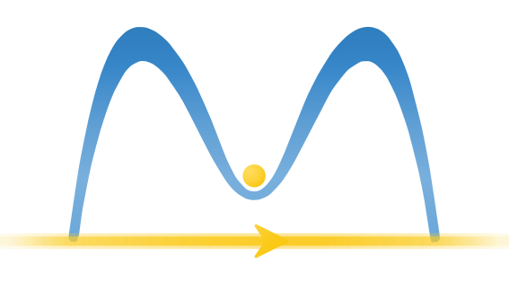

<h1> Migdal</h1>

[](https://github.com/zhcui/migdal/actions/workflows/ci.yml)
[](https://github.com/zhcui/migdal/actions/workflows/mpi.yml)
[](https://github.com/zhcui/migdal_preview/actions/workflows/docs.yml)
[](https://codecov.io/gh/zhcui/migdal)
[](https://www.python.org/downloads/)
[](LICENSE)

Migdal implements G0W0, GW0, scGW, and a Takada projected pairing solver for an
SrTiO3-like one-band model.  The sparse-IR drivers use radial momentum grids,
Coulomb-aware interpolation, and MPI-ready convolution kernels.

**Pre-publication release note.** This repository currently provides the public
README and automatically built documentation preview.  The source code,
runnable scripts, tests, package metadata, code-test workflows, and archived
software release will be published here together with the accepted article.

## Layout

- `migdal/`: main package.
- `examples/`: runnable Migdal examples and reference outputs.
- `docs/`: Sphinx documentation, including the quickstart, theory guide,
  examples guide, API entry points, output guide, and troubleshooting notes.
- `migdal/test/`: regression tests.

## Installation

Migdal supports Python 3.10 and newer.

The recommended installation builds the optimized Cython/OpenMP radial kernels.
On Ubuntu, install a compiler and MPI/OpenMP development headers first:

```bash
sudo apt-get update
sudo apt-get install -y build-essential libgomp1 openmpi-bin libopenmpi-dev
```

Then install Python dependencies and require the optimized kernels during the
editable package install:

```bash
python -m pip install --upgrade pip setuptools wheel Cython
python -m pip install -r requirements.txt
MIGDAL_REQUIRE_OPENMP=1 python -m pip install -e .
```

Check that both compiled radial kernels are available:

```bash
python - <<'PY'
from migdal import radial

assert radial._cython_radial_available()
assert radial._qw_cython_available()
print("compiled radial kernels available")
PY
```

The radial Cython extensions can fall back to pure Python when explicitly
disabled or when OpenMP/Cython is unavailable, but that path is mainly for
debugging and CI fallback checks:

```bash
MIGDAL_DISABLE_OPENMP=1 python -m pip install -e .
MIGDAL_DISABLE_CYTHON_RADIAL=1 python -c "from migdal import radial; assert not radial._cython_radial_available()"
MIGDAL_DISABLE_CYTHON_RADIAL=1 python -m pytest -q \
  migdal/test/test_model.py migdal/test/test_grid.py migdal/test/test_freq.py
```

## Examples

Run examples from the repository root.  The first tutorial is serial:

```bash
python examples/01_ir_noninteracting_gf/run.py
```

Most radial examples are intended to run under MPI:

```bash
mpirun -n 2 python examples/03_g0w0_takada_curve/run.py
```

See `examples/README.md` for the full example map.

## Documentation

The rendered documentation website is available at
<https://zhcui.github.io/migdal_preview/>.

The documentation website can be built locally with Sphinx:

```bash
python -m pip install -r docs/requirements.txt
python -m sphinx -M clean docs docs/_build
python -m sphinx -b html docs docs/_build/html
```

Open `docs/_build/html/index.html` in a browser. Start with
`docs/quickstart.md` for a runnable path, then `docs/workflows.md` for common
calculation paths, `docs/parameters.md` for driver settings, and
`docs/output.md` for output interpretation. Use `docs/troubleshooting.md` when
convergence, grid, cache, or denominator diagnostics need follow-up.

The website is deployed through `.github/workflows/docs.yml`. Pull requests
build the documentation as a check; pushes to `main` publish `docs/_build/html`
to GitHub Pages.


## Tests

Run the default regression suite with:

```bash
python -m pytest -q migdal/test
```

CI runs the default serial suite with Cython/OpenMP kernels and coverage, plus a
pure-Python fallback job.  MPI checks are opt-in locally and run in a separate
GitHub Actions workflow:

```bash
MIGDAL_RUN_MPI_TESTS=1 python -m pytest -q -m mpi \
  migdal/test/test_mpi.py migdal/test/test_ir_cache.py
```

Use `MIGDAL_MPIEXEC` to customize the MPI launcher.  For example, with an
Open MPI launcher that needs oversubscription:

```bash
MIGDAL_RUN_MPI_TESTS=1 MIGDAL_MPIEXEC="mpirun --oversubscribe" \
  python -m pytest -q -m mpi migdal/test/test_mpi.py
```

## Package checks

CI also checks that source and wheel distributions build cleanly:

```bash
python -m pip install build twine
MIGDAL_REQUIRE_OPENMP=1 python -m build
python -m twine check --strict dist/*
```

## Bug reports and feature requests

Please submit tickets on the
[issues](https://github.com/zhcui/migdal_preview/issues) page.
